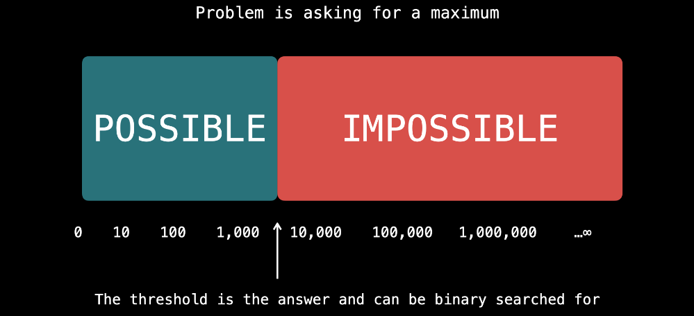

# Binary Search

Binary search is a search algorithm that runs in $O(logn)$ in the worst case, where $n$ is the size of the search space. For binary search to work, your search space usually needs to be sorted. Binary search trees, which we looked at in the trees and graphs chapter, are based on binary search.

Normally, binary search is done on an array of sorted elements, but you can use binary search in more creative ways, as we'll see in an upcoming article. For now, we'll just talk about sorted arrays of numbers

If you have a sorted array `arr` and an element `x`, then in  $O(logn)$ time and $O(1)$  space, binary search can:

- Find the index of `x` if it is in `arr`
- Find the first or the last index in which `x` can be inserted to maintain being sorted otherwise

Here's the idea behind binary search:

Let's say that there is a sorted integer array `arr`, and you know that the number `x` is in it, but you don't know at what index. You want to find the position of `x`. Start by checking the element in the middle of `arr`. If this element is too small, then we know every element in the left half will also be too small, since the array is sorted. Similarly, if the element is too large, then every element in the right half will also be too large.

We can discard the half that can't contain `x`, and then repeat the process on the other half. We continue this process of cutting the array in half until we find `x`.

This is how binary search is implemented:

1. Declare `left = 0` and `right = arr.length - 1`. These variables represent the inclusive bounds of the current search space at any given time. Initially, we consider the entire array.
2. While `left <= right`:
    - Calculate the middle of the current search space, `mid = (left + right) // 2` (floor division)
    - Check `arr[mid]`. There are 3 possibilities:
        - If `arr[mid] = x`, then the element has been found, return.
        - If `arr[mid] > x`, then halve the search space by doing `right = mid - 1`.
        - If `arr[mid] < x`, then halve the search space by doing `left = mid + 1`.
3. If you get to this point without `arr[mid] = x`, then the search was unsuccessful. The `left` pointer will be at the index where `x` would need to be inserted to maintain `arr` being sorted.
4. 

Because the search space is halved at every iteration, binary search's worst case time complexity is $O(logn)$ This makes it an extremely powerful algorithm as logarithmic time is **very** fast compared to linear time.

## Implementation Templates

```python
def binary_search(arr, target):
    left = 0
    right = len(arr) - 1
    while left <= right:
        mid = (left + right) // 2
        if arr[mid] == target:
            # do something
            return
        if arr[mid] > target:
            right = mid - 1
        else:
            left = mid + 1
    
    # target is not in arr, but left is at the insertion point
    return left
```

## Duplicate Elements

If your input has duplicates, you can modify the binary search template to find either the first or the last position of a given element. If `target` appears multiple times, then the following template will find the left-most index:

```python
def binary_search(arr, target):
    left = 0
    right = len(arr)
    while left < right:
        mid = (left + right) // 2
        if arr[mid] >= target:
            right = mid
        else:
            left = mid + 1

    return left
```

The following template will find the right-most **insertion point** (the index of the right-most element plus one):

```python
def binary_search(arr, target):
    left = 0
    right = len(arr)
    while left < right:
        mid = (left + right) // 2
        if arr[mid] > target:
            right = mid
        else:
            left = mid + 1

    return left
```

<aside>
📢

You should think about binary search anytime the problem provides anything sorted$O(logn)$ is extremely fast and binary search is usually a huge optimization.

</aside>

# On Solution Spaces

There is a more creative way to use binary search - on a solution space/answer. A very common type of problem is "what is the max/min that something can be done". Binary search can be used if the following criteria are met:

1. You can quickly (in $*O(n)*$or better) verify if the task is possible for a given number `x`.
2. If the task is possible for a number `x`, and you are looking for:
    - A maximum, then it is also possible for all numbers less than `x`.
    - A minimum, then it is also possible for all numbers greater than `x`.
3. If the task is not possible for a number `x`, and you are looking for:
    - A maximum, then it is also impossible for all numbers greater than `x`.
    - A minimum, then it is also impossible for all numbers less than `x`.

The 2nd and 3rd requirements imply that there are two "zones". One where it is possible and one where it is impossible. The zones have no breaks, no overlap, and are separated by a threshold



When a problem wants you to find the min/max, it wants you to find the threshold where the task transitions from impossible to possible

First, we establish the possible solution space by identifying the minimum possible answer and the maximum possible answer

Next, we binary search on this solution space. For each `mid`, we perform a check to see if the task is possible. Depending on the result, we halve the search space. Eventually, we will find the threshold.

If the first requirement is met (quick verification if  `mid` is possible), then this will give us a time complexity of $O(n.logk)$ is the solution space's range. Even if the possible solution space is huge, logarithms run so fast that this is a very efficient time complexity