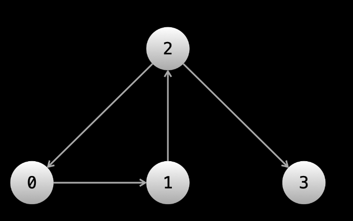
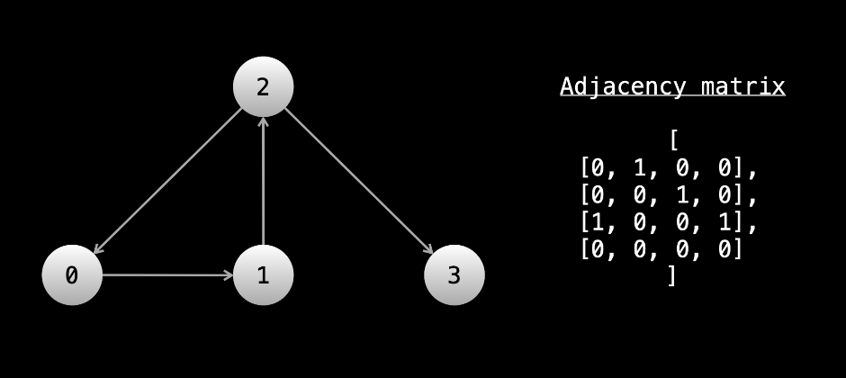

# Graphs

A graph is any collection of nodes and connections between those nodes.

> Another term for nodes is vertices, and the connections between the nodes are called edges.

Remember that a binary tree is a graph, it just has a lot of restrictions on it. The most prominent ones are that every node has at most one parent and at most two children. When we lift the restrictions, graphs can take many more forms.

Graphs are part of our everyday lives. Without even trying too hard, you can model literally anything as a graph. Some examples of practical applications would be social networks like Facebook, Twitter, Instagram, and TikTok, the roads in cities, circuit boards, internet network traffic, crypto blockchains, models in biology, and so much more.

## Graph Terminology

Before we dive in, you will first need to become familiar with some graph terminology.

Edges of a node can either be **directed or undirected**. Directed edges mean that you can only traverse in one direction. If you're at node A and there is a directed edge to node B, you can move from A -> B, but once you're at B you can't move B -> A. In graphical representations, directed edges will be arrows between nodes. Undirected edges mean that you can traverse in both directions. So using the same example, you can move from A -> B and B -> A. In graphical representations, undirected edges will just be straight lines between nodes

> In binary trees, the edges were directed. Binary trees are directed graphs. You can't access a node's parent, only its children. Once you move to a child, you can't move back

Another important term is **connected component**. A connected component of a graph is a group of nodes that are connected by edges.

A node can have any number of edges connected to it. If we have a directed graph, it can have any number of edges leaving it and any number of edges entering it. The number of edges that can be used to reach the node is the node's **indegree**. The number of edges that can be used to leave the node is the node's **outdegree**. Nodes that are connected by an edge are called neighbors. So if you have a graph like A <-> B <-> C, A is neighbors with B, B is neighbors with A and C, and C is neighbors with B.

A graph can be either cyclic or acyclic. Cyclic means that the graph has a cycle, acyclic means that it doesn't

## How are graphs given in Algorithm problems?

In linked list problems, the head of the linked list is given. In binary tree problems, the root of the tree is given. In graph problems, only information about a graph is given. There are multiple common formats that this information can come in. We will take a look at a few

> Many times, the nodes of a graph will be labeled from 0 to n - 1. The problem statement may or may not explicitly state the input is a graph. Sometimes there might be a story, and you need to determine that the input is a graph. For example, "there are n cities labeled from 0 to n - 1". You can treat each city as a node and each city has a unique label.

With binary trees, traversal was easy because at any given node, we only needed to reference **node.left** and **node.right**. This allowed us to focus only on the traversal (with DFS or BFS). With graphs, a node can have any number of neighbors. Before we start our traversal, we usually need to do some work to make sure that for any given node, we can immediately access all the neighbors of said **node**.

### First input format: array of edges

In this input format, the input will be a 2D array. Each element of the array will be in the form **[x, y]**, which indicates that there is an edge between **x** and **y**. The problem may have a story for these edges - using the cities example, the story would be something like "**[x, y] means there is a highway connecting city x and city y**"

> The edges could be directed or undirected. This information will be in the problem description.

So, why can't we immediately start traversal? Let's say that we want to start a DFS from node 0 (sometimes the problem will state which node you should start from, sometimes you will need to figure this out yourself). When we're at node 0, how do we find the neighbors? We would need to iterate over the entire input to find all edges that include 0. When we move to a neighbor node, we would need to iterate over the entire input again to find all the neighbors of that node.

**At every node, we would need to iterate over the entire input to find the neighbors**. This is very slow!

Before starting the traversal, we can pre-process the input so that we can easily find all neighbors of any given node. Ideally, you want a data structure where you can give node as an argument and be returned a list of neighbors. The easiest way to accomplish this is using a hash map

Let's say you had a hash map graph that mapped integers to lists of integers. We can iterate over the input and for each [x, y] pair, we can put y in the list associated with graph[x]. If the edges are undirected, we will also need to put x in the list associated with graph[y]. After building this hash map, we can do graph[0] and immediately have all the neighbors of node 0.



This example graph can be represented by an array of directed edges: edges = [[0, 1], [1, 2], [2, 0], [2, 3]]

> Notice that the graph in the image does not exist in memory. It exists only as an idea derived from the array [[0, 1], [1, 2], [2, 0], [2, 3]].

Here's some example code for building graph from an array of edges:

```python
from collections import defaultdict

def build_graph(edges):
    graph = defaultdict(list)
    for x, y in edges:
        graph[x].append(y)
        # graph[y].append(x)
        # uncomment the above line if the graph is undirected

    return graph
```

### Second input format: adjacency list

In an adjacency list, the nodes will be numbered from 0 to n - 1. The input will be a 2D integer array, let's call it graph. graph[i] will be a list of all the outgoing edges from the ith node.

The graph in the image above can be represented by the adjacency list graph = [[1], [2], [0, 3], []].

Notice that with this input, we can already access all the neighbors of any given node. We don't need to do any pre-processing! This makes an adjacency list the most convenient format. If we want all the neighbors of node 6, we just check graph[6].

### Third input format: adjacency matrix

The next format is an adjacency matrix. Once again, the nodes will be numbered from 0 to n - 1. You will be given a 2D matrix of size n x n, let's call it graph. If graph[i][j] == 1, that means there is an outgoing edge from node i to node j. For example:



When given this format, you have two options. During the traversal, at any given node you can iterate over graph[node], and if graph[node][i] == 1, then you know that node i is a neighbor. Alternatively, you can pre-process the graph as we did with an array of edges. Build a hash map and then iterate over the entire graph. If graph[i][j] == 1, then put j in the list associated with graph[i]. This way, when performing the traversal, you will not need to iterate n times at every node to find the neighbors. This is especially useful when nodes have only a few neighbors and n is large.

Both of these approaches will have a time complexity of **O(n<sup>2</sup>)**

### Last input format: matrix

The last format we'll talk about is more subtle but very common. The input will be a 2D matrix and the problem will describe a story. Each square will represent something, and the squares will be connected in some way. For example, "Each square of the matrix is a village. Villages trade with their neighboring villages, which are the villages directly above, to the left, to the right, or below them."

In this case, each square (row, col) of the matrix is a node, and the neighbors are (row - 1, col), (row, col - 1), (row + 1, col), (row, col + 1) (if in bounds).
