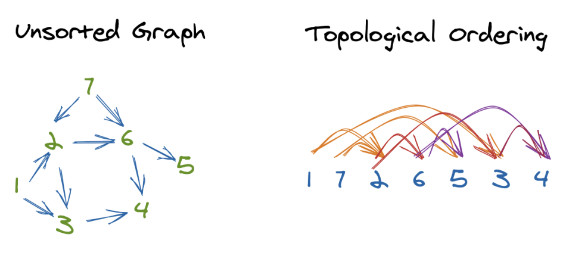

# Topological Sort



A topological sort is a sorting technique used to linearly sort the nodes in a tree or graph based on certain conditions

If there is an edge from $node A$ to $node B$ in a graph (which you'll see as $A --> B$), then $node A$ would be visited before $node B$ in a linearly sorted list of nodes. This is a fancy way of saying that they'll be in the order the graph "flows" or that the edges "point".

There are two main prerequisites to apply topological sort on a graph:

1. The graph should be acyclic, which means that there shouldn't be any two nodes that have an edge going from the first node to the second, and vice versa.

2. The graph needs to be directed.

Basiclly it should be a DAG(directed acyclic graph)

**Rule for Topological sort** : Vertex with no incoming edges is accessed first followed by the vertices on the outgoing paths.

### Topological sorting using DFS

A topologically sorted order could be found by doing a **DFS** on the graph. While doing a DFS, a stack is maintained to store the nodes in a reverse topologically sorted order. A node is pushed into the stack only after all the adjacent nodes on its outgoing edges are visited. When the DFS ends, the nodes are popped off the stack to get a topologically sorted order

Time Complexity : $O(v+e)$ for an adjacency list implementation of a graph . "V" is the no of vertices and "E" is the no of Edges

```python
from collections import deque, defaultdict

class Graph :

    def __init__(self, arg_nodes : int) :
        self.nodes = arg_nodes
        self.visited = [False] * self.nodes
        # The default dictionary would create an empty list as a default (value)
        # for the nonexistent keys.
        self.adjlist = defaultdict(list)
        self.stack  = deque()

    def AddEdge(self, src : int, dst : int) :
        self.adjlist[src].append(dst)

    def TopologicalSort(self, src : int) :

        self.visited[src] = True

        # Check if there is an outgoing edge for a node in the adjacency list
        if src in self.adjlist :
            for node in self.adjlist[src] :
                if self.visited[node] == False :
                    self.TopologicalSort(node)

        # Only after all the nodes on the outgoing edges are visited push the
        # source node in the stack
        self.stack.appendleft(src)

    def Traverse(self) :
        for node in range(self.nodes) :
            if self.visited[node] == False :
               self.TopologicalSort(node)

        print("Topological Sorting Order : ", end = ' ')
        while self.stack :
            print(self.stack.popleft(),end=' ')

def main() :

    node_cnt = 7
    g = Graph(node_cnt)

    g.AddEdge(0,2)
    g.AddEdge(0,5)
    g.AddEdge(1,3)
    g.AddEdge(1,6)
    g.AddEdge(2,4)
    g.AddEdge(3,5)
    g.AddEdge(5,2)
    g.AddEdge(5,4)
    g.AddEdge(6,2)

    g.Traverse()

if __name__ == "__main__" :
    main()


```

Output:

```python
Topological Sorting Order :  1 6 3 0 5 2 4
```
