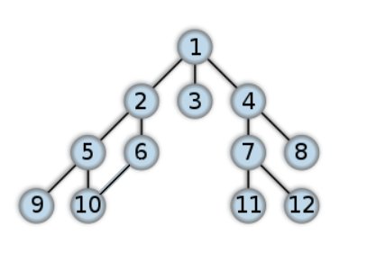
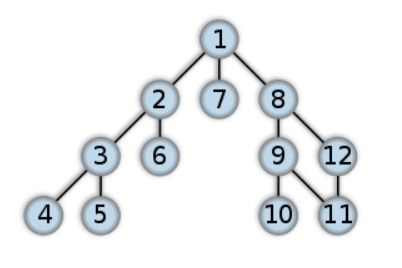

# cycle detection in undirected Graph



For example, the following graph contains a cycle $2–5–10–6–2$

## Using BFS

When we do a Breadth–first search (BFS) from any vertex v in an undirected graph, we may encounter a cross-edge that points to a previously discovered vertex that is neither an ancestor nor a descendant of the current vertex. Each “cross edge” defines a cycle in an undirected graph. If the cross edge is $x —> y$, then since y is already discovered, we have a path from v to y (or from y to v since the graph is undirected), where v is the starting vertex of BFS. So, we can say that we have a path **v ~~ x ~ y ~~ v** that forms a cycle. (Here, ~~ represents one more edge in the path, and ~ represents a direct edge).

```python
from collections import deque


# A class to represent a graph object
class Graph:

    # Constructor
    def __init__(self, edges, n):

        # A list of lists to represent an adjacency list
        self.adjList = [[] for _ in range(n)]

        # add edges to the undirected graph
        for (src, dest) in edges:
            self.adjList[src].append(dest)
            self.adjList[dest].append(src)


# Perform BFS on the graph starting from vertex `src` and
# return true if a cycle is found in the graph
def BFS(graph, src, n):

    # to keep track of whether a vertex is discovered or not
    discovered = [False] * n

    # mark the source vertex as discovered
    discovered[src] = True

    # create a queue for doing BFS
    q = deque()

    # enqueue source vertex and its parent info
    q.append((src, -1))

    # loop till queue is empty
    while q:

        # dequeue front node and print it
        (v, parent) = q.popleft()

        # do for every edge (v, u)
        for u in graph.adjList[v]:
            if not discovered[u]:
                # mark it as discovered
                discovered[u] = True

                # construct the queue node containing info
                # about vertex and enqueue it
                q.append((u, v))

            # `u` is discovered, and `u` is not a parent
            elif u != parent:
                # we found a cross-edge, i.e., the cycle is found
                return True

    # no cross-edges were found in the graph
    return False


if __name__ == '__main__':

    # List of graph edges
    edges = [
        (0, 1), (0, 2), (0, 3), (1, 4), (1, 5), (4, 8),
        (4, 9), (3, 6), (3, 7), (6, 10), (6, 11), (5, 9)
        # edge (5, 9) introduces a cycle in the graph
    ]

    # total number of nodes in the graph (0 to 11)
    n = 12

    # build a graph from the given edges
    graph = Graph(edges, n)

    # Perform BFS traversal in connected components of a graph
    if BFS(graph, 0, n):
        print('The graph contains a cycle')
    else:
        print('The graph doesn\'t contain any cycle')
```

## Using DFS



The following graph contains a cycle $8—9—11—12—8$

When we do a Depth–first search (DFS) from any vertex v in an undirected graph, we may encounter a back-edge that points to one of the ancestors of the current vertex v in the DFS tree. Each “back edge” defines a cycle in an undirected graph. If the back edge is $x —> y$, then since y is the ancestor of node x, we have a path from y to x. So, we can say that we have a path y ~~ x ~ y that forms a cycle. (Here, ~~ represents one more edge in the path, and ~ represents a direct edge).

```python
# A class to represent a graph object
class Graph:

    # Constructor
    def __init__(self, edges, n):

        # A list of lists to represent an adjacency list
        self.adjList = [[] for _ in range(n)]

        # add edges to the undirected graph
        for (src, dest) in edges:
            self.adjList[src].append(dest)
            self.adjList[dest].append(src)


# Function to perform DFS traversal on the graph on a graph
def DFS(graph, v, discovered, parent=-1):

    # mark the current node as discovered
    discovered[v] = True

    # do for every edge (v, w)
    for w in graph.adjList[v]:

        # if `w` is not discovered
        if not discovered[w]:
            if DFS(graph, w, discovered, v):
                return True

        # if `w` is discovered, and `w` is not a parent
        elif w != parent:
            # we found a back-edge (cycle)
            return True

    # No back-edges were found in the graph
    return False


if __name__ == '__main__':

    # List of graph edges
    edges = [
        (0, 1), (0, 6), (0, 7), (1, 2), (1, 5), (2, 3),
        (2, 4), (7, 8), (7, 11), (8, 9), (8, 10), (10, 11)
        # edge (10, 11) introduces a cycle in the graph
    ]

    # total number of nodes in the graph (0 to 11)
    n = 12

    # build a graph from the given edges
    graph = Graph(edges, n)

    # to keep track of whether a vertex is discovered or not
    discovered = [False] * n

    # Perform DFS traversal from the first vertex
    if DFS(graph, 0, discovered):
        print('The graph contains a cycle')
    else:
        print('The graph doesn\'t contain any cycle')
```

The time complexity of the above solutions is $O(V + E)$, where V and E are the total number of vertices and edges in the graph, respectively
