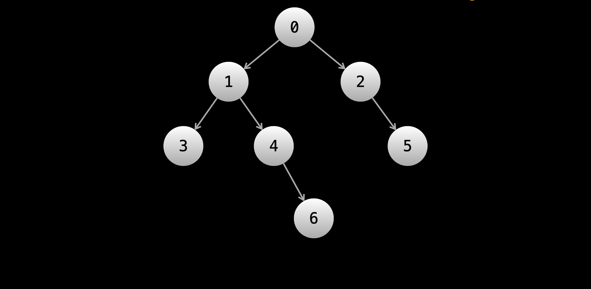

# Binary Trees - DFS

> Before starting this article, please make sure you have a complete understanding of what a binary tree is and how it is represented in code, as well as a solid understanding of recursion.

In this article, we'll talk about how to traverse binary trees. Tree traversal is how we access the elements of a tree, and thus is mandatory for solving tree problems.

Recall that in the linked list chapter, we traversed a linked list using the following code:

```python
def get_sum(head):
    ans = 0
    while head:
        ans += head.val
        head = head.next

    return ans
```

The above code starts at the head and visits each node to find the sum of all values in the linked list.

For each node, there is a moment in the code execution where the head variable is referencing the node. We traverse by using the .next attribute.

Traversing a binary tree follows the same idea. We start at the root and traverse by using the child pointers .left and .right. When traversing linked lists, we usually do it iteratively. With binary trees, we usually do it recursively.

There are two main types of tree traversals. The first is called depth-first search (DFS). For binary trees specifically, there are 3 ways to perform DFS - preorder, inorder, and postorder (don't worry though, the type you choose rarely matters). The other main type of traversal is called breadth-first search (BFS). Let's start by looking at DFS.

## Depth First Search (DFS)

> Recall that the depth of a node is its distance from the root.

In a DFS, we prioritize depth by traversing as far down the tree as possible in one direction (until reaching a leaf node) before considering the other direction. For example, let's say we choose left as our priority direction. We move exclusively with node.left until the left subtree has been fully explored. Then, we explore the right subtree.

Trees are named as such because they resemble real-life trees. You can think of the paths of a binary tree as branches growing from the root. DFS chooses a branch and goes as far down as possible. Once it fully explores the branch, it backtracks until it finds another unexplored branch.

Because we need to backtrack up the tree after reaching the end of a branch, DFS is typically implemented using recursion, although it is also sometimes done iteratively using a stack. Here is a simple example of recursive DFS to visit every node:

> Each call to dfs(node) is visiting that node. As you can see in the code, we visit the left child before visiting the right child.

```python
def dfs(node):
    if node == None:
        return

    dfs(node.left)
    dfs(node.right)
    return
```

The good news is that the structure for performing a DFS is very similar across all problems. It goes as follows:

1. Handle the base case(s). Usually, an empty tree (node = null) is a base case.
2. Do some logic for the current node
3. Recursively call on the current node's children
4. Return the answer

> As we will see in a moment, steps 2 and 3 may happen in different orders.

The most important thing to understand when it comes to solving binary tree problems is that **each function call solves and returns the answer to the original problem as if the subtree rooted at the current node was the input**. The logic that will be done at each call (step 2) will depend on the problem.

Let's take a look at the types now, using the following tree as a talking point:



### Preorder Traversal

In preorder traversal, logic is done on the current node before moving to the children. Let's say that we wanted to just print the value of each node in the tree to the console. In that case, at any given node, we would print the current node's value, then recursively call the left child, then recursively call the right child.

```python
def preorder_dfs(node):
    if not node:
        return

    print(node.val)
    preorder_dfs(node.left)
    preorder_dfs(node.right)
    return
```

Running the above code on the example tree, we would see the nodes printed in this order: **0, 1, 3, 4, 6, 2, 5.**

Because the logic (printing) is done immediately at the start of each function call, preorder handles nodes in the same order that the function calls happen.

### Inorder Traversal

For inorder traversal, we first recursively call the left child, then perform logic (print in thise case) on the current node, then recursively call the right child. This means no logic will be done until we reach a node without a left child since calling on the left child takes priority over performing logic.

```python
def inorder_dfs(node):
    if not node:
        return

    inorder_dfs(node.left)
    print(node.val)
    inorder_dfs(node.right)
    return
```

Running the above code on the example tree, we would see the nodes printed in this order: **3, 1, 4, 6, 0, 2, 5**.

Notice that for any given node, its value is not printed until all values in the left subtree are printed, and values in its right subtree are not printed until after that.

### Postorder Traversal

In postorder traversal, we recursively call on the children first and then perform logic on the current node. This means no logic will be done until we reach a leaf node since calling on the children takes priority over performing logic. In a postorder traversal, the root is the last node where logic is done.

```python
def postorder_dfs(node):
    if not node:
        return

    postorder_dfs(node.left)
    postorder_dfs(node.right)
    print(node.val)
    return
```

Running the above code on the example tree, we would see the nodes printed in this order: **3, 6, 4, 1, 5, 2, 0**.

Notice that for any given node, no values in its right subtree are printed until all values in its left subtree are printed, and its own value is not printed until after that.

> The name of each traversal is describing when the current node's logic is performed.
> Pre -> before children ,
> In -> in the middle of children ,
> Post -> after children
